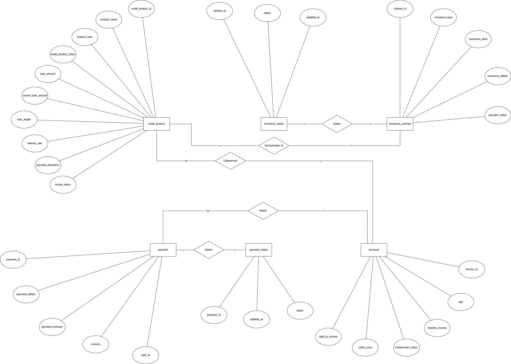
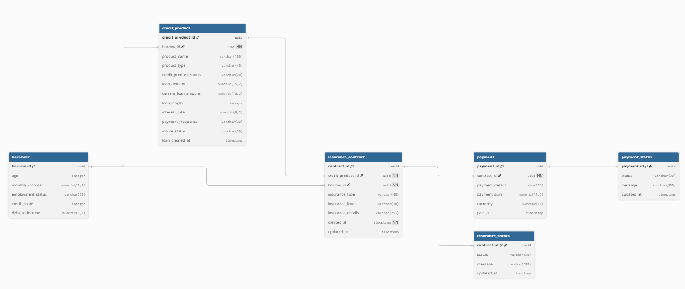
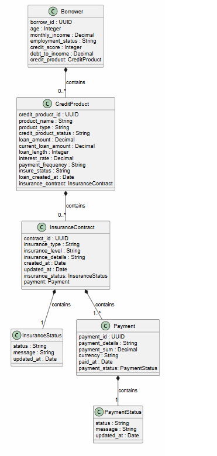

Описание концептуальной, логической и физической моделей данных
=========================================

Концептуальная модель данных в нотации Чена
-----------------------------------------

Логическая/физическая модель данных в нотации Мартина
-----------------------------------------

Данные таблиц
-----------------------------------------
borrower

|Атрибут|Тип данных|Ограничения|Описание|
|-|-|-|-|
|borrow_id|UUID|PK|Идентификатор заемщика|
|age|INTEGER|NOT NULL, CHECK (age>0, age<100)|Возраст заемщика|
|monthly_income|NUMERIC (9,2)|NOT NULL, CHECK (monthly_income &ge; 0, monthly_income &le; 100000000)|Официальный ежемесячный доход|
|employment_status|VARCHAR (12)|NOT NULL|Статус занятости|
|credit_score|INTEGER|NOT NULL, CHECK (credit_score &ge; 0, credit_score &le; 100)|Скоринговый балл|
|debt_to_income|NUMERIC (5,2)|NOT NULL, CHECK (credit_score &ge; 0, credit_score &le; 100)|Отношение ежемесячных платежей по всем кредитам к доходу|

credit_product

|Атрибут|Тип данных|Ограничения|Описание|
|-|-|-|-|
|credit_product_id|UUID|PK|Идентификатор кредитного продукта|
|borrow_id|UUID|FK, NOT NULL|Идентификатор заемщика|
|product_name|VARCHAR (100)|NOT NULL, UNIQUE|Название продукта|
|product_type|VARCHAR (23)|CHECK (product_type IN (Кредит физическим лицам, Кредит юридическим лицам, Межбанковский кредит, Государственный кредит))|Тип кредитного продукта|
|credit_product_status|VARCHAR (8)|NOT NULL|Статус продукта|
|loan_amount|NUMERIC (11,2)|NOT NULL, CHECK (loan_amount &gt; 0, loan_amount &le; 100000000)|Сумма кредита|
|current_loan_amount|NUMERIC (11,2)|NOT NULL, CHECK (current_loan_amount &ge 0, current_loan_amount &le; 100000000)|Оставшаяся сумма кредита|
|loan_length|INTEGER|NOT NULL, CHECK (loan_length &ge; 1, loan_length &le; 600)|Срок кредита в месяцах|
|interest_rate|NUMERIC (5,2)|NOT NULL, CHECK (interest_rate &ge; 1, interest_rate &le; 100)|Годовая ставка в процентах|
|payment_frequency|VARCHAR (10)|NOT NULL|Частота платежей|
|insure_status|VARCHAR (14)|NOT NULL|Статус страхования кредитного продукта|
|loan_created_at|TIMESTAMP|NOT NULL|Дата и время создания страхования|

insurance_contract

|Атрибут|Тип данных|Ограничения|Описание|
|-|-|-|-|
|contract_id|UUID|PK|Идентификатор договора страхования|
|credit_product_id|UUID|FK, NOT NULL|Идентификатор кредитного продукта|
|borrow_id|UUID|FK, NOT NULL|Идентификатор заемщика|
|insurance_type|VARCHAR (23)|CHECK (insurance_type IN (инверсивное страхование, страхование с залогом))|Тип страхования|
|insurance_level|VARCHAR (19)|CHECK (insurance_level IN (инверсивное страхование, страхование с залогом))|Уровень страхования|
|insurance_details|VARCHAR (255)|NOT NULL|Детали страхования|
|created_at|TIMESTAMP|NOT NULL|Дата и время страхования|
|updated_at|TIMESTAMP||Дата и время обновления страхования|

payment

|Атрибут|Тип данных|Ограничения|Описание|
|-|-|-|-|
|payment_id|UUID|PK|Идентификатор оплаты|
|contract_id|UUID|FK, NOT NULL|Идентификатор договора страхования|
|payment_details|VARCHAR (12)|NOT NULL|Реквизиты оплаты (RNN)|
|payment_sum|NUMERIC (9,2)|NOT NULL, CHECK (payment_sum &gt; 0, payment_sum &le; 1000000)|Размер оплаты|
|currency|VARCHAR (6)|NOT NULL|Валюта|
|paid_at|TIMESTAMP|NOT NULL|Дата и время оплаты страхования|

payment_status

|Атрибут|Тип данных|Ограничения|Описание|
|-|-|-|-|
|payment_id|UUID|PK|Идентификатор оплаты|
|status|VARCHAR (10)|NOT NULL|Статус обработки платежа|
|message|VARCHAR (255)|NOT NULL|Дополнительная информация|
|updated_at|TIMESTAMP||Время последнего изменения статуса|

insurance_status

|Атрибут|Тип данных|Ограничения|Описание|
|-|-|-|-|
|contract_id|UUID|PK|Идентификатор договора страхования|
|status|VARCHAR (10)|CHECK (status IN (pending, processing, completed, failed))|Текущий статус обработки|
|message|VARCHAR (255)|NOT NULL|Дополнительная информация|
|updated_at|TIMESTAMP||Время последнего изменения статуса|

Class Diagram MongoDB
-----------------------------------------

DDL Scripts
-----------------------------------------
[DDL](Insurance_APP_DB.sql)

DML Scripts
-----------------------------------------
[DML](DB_Examples.sql)

JSON-Schema
-----------------------------------------
[JSON-Schema](MongoDB_Validation_Schema.json)

JSON-Object
-----------------------------------------
[JSON-Object](MongoDB_Validation_Object.json)

### Критерии приемки

#### Процесс и контекст использования
Применяется на этапе проектирования информационной системы для формирования структуры хранения данных в PostgreSQL и MongoDB.

#### Цель создания
Описать структуру данных, определить взаимосвязи между сущностями и правила организации их хранения.

#### Что становится определено
Определяются сущности, их атрибуты, взаимосвязи, ограничения целостности данных и структура документов в MongoDB.

#### Пользователи артефакта
Системные аналитики, разработчики и администраторы баз данных используют модель при разработке, внедрении и сопровождении базы данных.

#### Использование в дальнейшем
На основе разработанной модели создаются базы данных, реализуются запросы, API и бизнес-логика приложения.

#### Последствия отсутствия
Отсутствие модели может привести к ошибкам при проектировании базы данных, нарушению согласованности данных и увеличению сроков разработки.